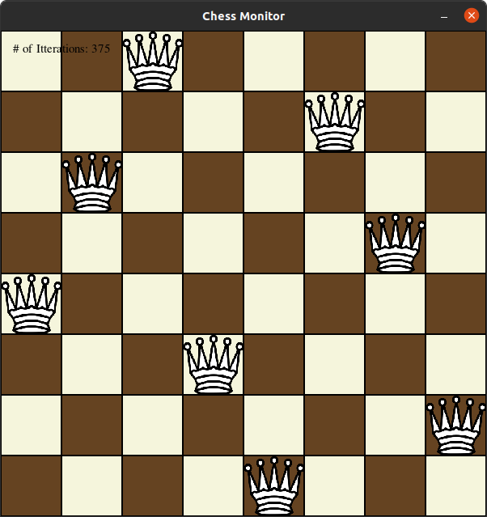

# N Figures Monitor

Монитор - программа для отображения решения системы, может быть подключено одновременно несколько мониторов. Реализован на двух потоках:
* Поток взаимодействия с пользователем: визуализирует доску, считывает нажатие клавиш, отправляет запросы серверу;
* Поток взаимодействия с сервером: принимает от сервера информацию об изменении доски, обновляет доску.

<b>Необходимо запускать после запуска сервера. </b>

Демонстрация работы сервера

